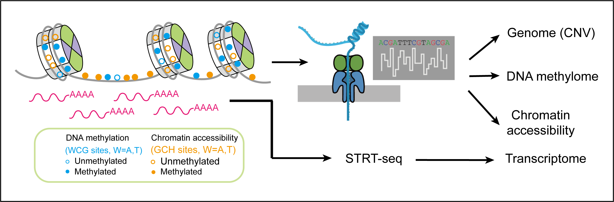

scNanoCOOL-seq
=========

Source code of the sequencing method scNanoCOOL-seq and the manuscript ***scNanoCOOL-seq: a single-cell multi-omics sequencing method based on the third generation sequencing platform***.

## Overview
--------
scNanoCOOL-seq technology mainly uses bisulfite conversion and single-barcode PCR amplification strategies and finally obtained DNA fragments of approximately 900 bp in length. As shown in the Figure 1 below, the experimental process of scNanoCOOL-seq mainly includes: 1) cell lysis in a gentle way and in vitro methylation by DNA transferase M.CviPI enzyme, followed by nucleocytoplasmic separation of single cells; 2) the nucleus of single cells is processed with single-linker amplification after bisulfite treatment and PBAT-like library construction and is used for single-molecule sequencing on the Nanopore platform; 3) the cytoplasmic part of the single cell is used for scRNA-seq library construction (optimized STRT-seq). 

 
​

## Content
-------
* `bin/`: functions used in each section from pre-processing to downstream analysis
* `data/`: example data provided to reproduce the result
* `reference/`: necessary files as the reference
* `vignettes/`: brief introductions for each section

## Data
-------
The raw data is accessible at SRA [PRJNA905717](https://www.ncbi.nlm.nih.gov/sra/PRJNA905717). Parsed data is provided upon request.

## Contact
-------
* Computational analysis: Xiaohui Xue (xxhui@stu.pku.edu.cn) 

